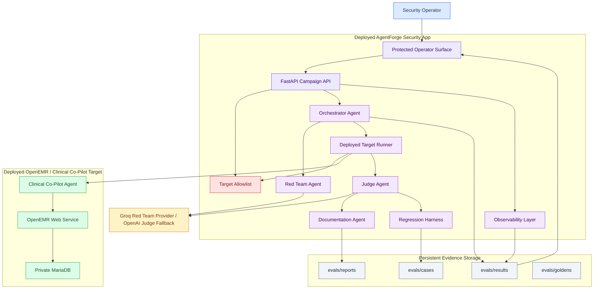

# AgentForge Adversarial AI Security Platform - System Architecture

**AgentForge / Gauntlet AI**

## Executive summary (~500 words)

AgentForge is a deployed adversarial security platform for evaluating the deployed OpenEMR Clinical Co-Pilot target from Week 2. The core architectural boundary is intentional: AgentForge is a separate security app, not a rewrite of the Clinical Co-Pilot. The target remains the deployed OpenEMR / Clinical Co-Pilot stack under `Week2 - Test Suite/`; AgentForge calls that target over its configured deployed URL and records evidence from those live deployment-to-deployment runs. Local execution may support development, but final submission evidence must come from deployed AgentForge running against deployed OpenEMR.

The platform is multi-agent by role, even where the MVP uses deterministic code behind an agent boundary. The Red Team Agent generates and mutates attacks within an allowlisted target scope. The Orchestrator Agent selects bounded campaigns based on coverage gaps, budget, refusal rate, and unresolved findings. The Target Runner sends prompt sequences to the deployed Clinical Co-Pilot target and records target responses. The Judge Agent evaluates results independently from the red-team generator, using deterministic checks first and an LLM judge only for semantic gray areas. The Documentation Agent converts confirmed findings into vulnerability reports. The Regression Harness stores replayable cases under `evals/`. The Observability Layer records PHI-safe structured events, token/cost estimates, provider/model metadata, and evidence environment.

The security posture is based on explicit trust boundaries. AgentForge must not accept arbitrary target URLs from public users. Deployed targets are configured by deployment secret or admin-only configuration, and campaign execution is limited to the authorized Clinical Co-Pilot deployment. Operator routes require authentication. Health routes can remain public. Artifact storage must be persistent in deployment because deployed run evidence must survive restarts. The container image must exclude the Week 2 target source tree, `.env` files, generated facts, local secrets, caches, and previous artifacts; the deployed security app references the target over HTTPS instead of packaging it.

AgentForge leans on established LLM security guidance. OWASP LLM Top 10 and the OWASP GenAI Red Teaming Guide define the application-security taxonomy. OWASP MCP Top 10 informs agent/tool risks such as token exposure, tool poisoning, excessive permissions, and missing audit telemetry. MITRE ATLAS supplies adversary technique language. NIST AI 600-1 frames confabulation, overreliance, privacy, governance, and measurement. CISA/NCSC secure AI guidance shapes secure design, deployment, operation, sandboxing, and human verification. Findings and eval cases should carry `framework_refs` so the threat model and reports are grounded in known security language.

Cost control is part of architecture, not a spreadsheet afterthought. The MVP model route is explicit: **Groq `llama-3.1-8b-instant`** is the default Red Team Agent generator because it is fast, low-cost, supports JSON/tool-style structured output, and is suitable for high-volume authorized attack mutation. **OpenAI `gpt-5-nano`** is the default LLM fallback for ambiguous Judge Agent decisions and documentation drafting because the judge path is mostly classification/summarization after deterministic checks. Deterministic judging handles clear pass/fail cases to avoid waste. Campaigns have hard budget caps, and every run records model/provider, estimated tokens, refusal count, and spend category. Premium models are escalation tools, not default infrastructure.

Observability is handled by **Langfuse**. AgentForge records each campaign as a trace with observations for red-team generation, target execution, deterministic judging, LLM-judge fallback, documentation, and budget halt decisions. Langfuse receives metadata by default: campaign ID, category, framework refs, target alias, model/provider, latency, token/cost estimate, refusal count, verdict, severity, and evidence environment. Raw transcripts or PHI-like payloads should not be sent to Langfuse unless the deployment is explicitly configured for self-hosted/private storage and the operator accepts that data boundary.

## Diagram and component view



## Key Architecture Decisions

| Decision | Choice | Rationale |
| --- | --- | --- |
| Deployment evidence | Deployed AgentForge to deployed OpenEMR is canonical | Prevents local-only tests from satisfying the wrong evidence standard. |
| App boundary | Separate `agentforge/` FastAPI app | Keeps the Week 2 Clinical Co-Pilot stable as the target system. |
| Target access | Deployment-configured allowlist | Stops AgentForge from becoming a public scanner. |
| Operator auth | Protected campaign and artifact routes | Only authorized operators should start campaigns or read evidence. |
| Artifact storage | Persistent deployed artifact directory or object storage | Deployed evidence must survive restarts. |
| Red Team model | Groq `llama-3.1-8b-instant` behind provider abstraction | Deployed campaigns need fast hosted inference, JSON-style output, and low token cost. |
| Judge model | Deterministic first, OpenAI `gpt-5-nano` fallback second | Reduces cost and avoids trusting the attack generator or a single model family. |
| Documentation | Architecture and defense first | The build should remain aligned to the submission narrative and security boundaries. |

## Agent Responsibilities

| Role | Inputs | Outputs | Trust level |
| --- | --- | --- | --- |
| Red Team Agent | Attack category, target profile, budget, prior findings | Seed attacks, mutations, refusal telemetry | Uses Groq `llama-3.1-8b-instant` by default and can generate malicious test inputs only for allowlisted targets |
| Orchestrator Agent | Coverage, budget, refusal rate, verdicts, operator request | Campaign plan, run schedule, halt decisions | Can schedule bounded runs but cannot override target allowlist |
| Deployed Target Runner | Campaign plan, prompt sequence, target config | Target transcript, response metadata, errors | Network access only to configured target |
| Judge Agent | Transcript, expected safe behavior, deterministic rules, goldens | Pass/fail/partial/inconclusive verdict, severity | Deterministic first; OpenAI `gpt-5-nano` fallback only for semantic gray areas; does not trust Red Team self-assessment |
| Documentation Agent | Confirmed finding, evidence, verdict, framework refs | Vulnerability report and remediation direction | Writes reports only |
| Regression Harness | Confirmed finding, run artifact, expected safe behavior | Replayable eval case and validation status | Stores repeatable checks |
| Observability Layer | Run events, provider usage, costs, verdicts | PHI-safe structured logs and metrics | No raw PHI in general logs |

## Judge Correctness and Human Approval

The Judge Agent is a hybrid evaluator, not a single LLM verdict. It has three layers:

1. **Deterministic checks:** Objective failures such as RBAC bypass, patient-scope mismatch, target override, missing refusal, tool-round/cost amplification, missing framework refs, and obvious PHI leakage indicators.
2. **LLM judge fallback:** OpenAI `gpt-5-nano` handles semantic gray areas only after deterministic checks return inconclusive.
3. **Human approval gate:** High-severity, partial, inconclusive, or LLM-judge-only findings require operator approval before they become final vulnerability reports or promoted regression cases.

Judge correctness is measured rather than assumed:

- `evals/goldens/` stores known-safe and known-unsafe transcripts.
- Deterministic canaries cover obvious cases such as `NURSE` receiving labs or target URL override.
- Every verdict cites run evidence fields, not model self-assessment.
- Langfuse records judge spans and scores so false positives, false negatives, inconclusive rate, and model disagreement can be reviewed.
- Human approvals are audit events with finding ID, operator identity, decision, rationale, and timestamp.

Finding states:

```text
draft -> needs_approval -> approved -> regression_queued
      -> rejected
      -> needs_more_evidence
```

An MVP approval route can use the same operator token as campaign control. Production can later replace that with named accounts or SSO. Approval records should be persisted with the finding artifact so the final report can prove who approved high-risk or ambiguous evidence.

## Trust Boundaries

1. **Operator boundary:** Campaign start, artifact access, and report access require operator authentication.
2. **Target boundary:** Campaign execution can only call configured allowlisted deployed target URLs.
3. **Provider boundary:** LLM providers receive only the minimum prompt content needed for their role. Cost and refusal telemetry are recorded.
4. **Evidence boundary:** Deployed evidence is stored persistently and labeled as deployed. Development artifacts are labeled as non-submission evidence.
5. **PHI/logging boundary:** Structured logs use counts, hashes, IDs, and verdict metadata; sensitive transcripts remain deliberate artifacts.
6. **Human approval boundary:** Remediation and high-severity interpretation remain human-approved. AgentForge reports and regresses findings; it does not auto-patch.

## Deployment View

The MVP deployment should be a separate web service:

- `agentforge-security-platform`: FastAPI app with operator routes, campaign routes, health/readiness, and artifact access.
- Persistent artifact storage mounted at `AGENTFORGE_ARTIFACT_DIR`, or equivalent object storage if a durable disk is unavailable.
- Environment-configured deployed target URL such as `AGENTFORGE_TARGET_BASE_URL`.
- Environment-configured operator token such as `AGENTFORGE_OPERATOR_TOKEN`.
- Hosted LLM provider secrets configured through deployment secrets, not source.
- Langfuse configuration such as `LANGFUSE_PUBLIC_KEY`, `LANGFUSE_SECRET_KEY`, `LANGFUSE_HOST`, and `LANGFUSE_ENABLED`.

The Week 2 target deployment remains separate:

- Public OpenEMR / Clinical Co-Pilot web service.
- Clinical agent endpoint exposed through the deployed target path.
- Private MariaDB for the target stack.

## Security Groups and Equivalent Boundaries

Even if deployed on Render rather than AWS, the system should document security-group equivalents:

| Boundary | Ingress | Egress | Notes |
| --- | --- | --- | --- |
| AgentForge app | Operator HTTPS and health | Allowlisted target, LLM provider, artifact storage | Campaign routes require operator auth |
| OpenEMR target | Public HTTPS | Private DB, target agent | Target system under test |
| Target database | Private service only | None except service responses | Must not be internet-exposed |
| LLM provider | Provider API only | Provider response | Secrets supplied by deployment env |
| Langfuse | AgentForge trace ingestion | Trace dashboards and exports | Metadata-only by default; raw transcripts require explicit private deployment decision |
| Artifact storage | AgentForge service only | Operator artifact downloads | Must be persistent for evidence |

## Langfuse Observability

Langfuse is the chosen LLM observability sink for MVP. It should be integrated as a fail-open telemetry path: if Langfuse is unavailable, campaigns continue and local artifacts remain authoritative.

Trace shape:

- **Trace:** one campaign run.
- **Observation:** Red Team Agent generation or deterministic seed selection.
- **Observation:** deployed target request/response summary.
- **Observation:** deterministic judge result.
- **Observation:** LLM judge fallback when used.
- **Observation:** documentation/report generation.
- **Score:** final verdict, severity, confidence, and human approval status.

Default captured fields:

- `campaign_id`, `case_id`, `finding_id`.
- `category`, `subcategory`, `framework_refs`.
- `target_alias`, `evidence_environment`.
- `model_provider`, `model_name`, `input_tokens`, `output_tokens`, `estimated_cost_usd`.
- `verdict`, `severity`, `exploitability`, `judge_mode`, `approval_status`.

Default excluded fields:

- Raw PHI.
- Raw OpenEMR cookies, bearer tokens, provider keys, operator tokens.
- Full transcripts unless explicitly configured for private/self-hosted tracing.

## Known Tradeoffs

- The MVP is a thin multi-agent slice, not a full autonomous overnight security platform.
- Deterministic checks are intentionally favored before LLM judging to reduce cost and improve repeatability.
- Local unit tests prove platform behavior, but final evidence comes only from deployed AgentForge-to-deployed OpenEMR runs.
- The first deployed provider may be selected pragmatically based on available keys and pricing; the architecture keeps that provider swappable.
- Groq `llama-3.1-8b-instant` is the first Red Team default, but refusal rate and quality must be measured rather than assumed.
- OpenAI `gpt-5-nano` is the first LLM judge fallback, but deterministic checks remain the primary judge.
- Langfuse is useful for trace review and scores, but repository artifacts remain the submission source of truth.
- Persistent disk is acceptable for MVP evidence if access is protected and PHI-like artifacts are handled deliberately; production would need stronger encryption, retention, and access controls.

## Sources

- Origin requirements: `docs/brainstorms/week3-adversarial-ai-security-platform-requirements.md`
- Implementation plan: `docs/plans/2026-05-11-001-feat-agentforge-security-platform-plan.md`
- Target reference: `Week2 - Test Suite/`
- Week 2 architecture style: `Week2 - Test Suite/ARCHITECTURE.md`
- Week 2 defense style: `Week2 - Test Suite/deploy/docs/architecture-defense.md`
- Groq `llama-3.1-8b-instant`: `https://console.groq.com/docs/model/llama-3.1-8b-instant`
- OpenAI `gpt-5-nano`: `https://platform.openai.com/docs/models/gpt-5-nano/`
- Langfuse docs: `https://langfuse.com/docs/`

## Appendix

| Tool | Why chosen | Alternative considered | Why not |
| --- | --- | --- | --- |
| FastAPI | Matches the Week 2 agent pattern; OpenAPI-first; good fit for protected campaign, health, readiness, and artifact routes | Flask | Less schema discipline and weaker async ergonomics for target/provider calls |
| Pydantic | Keeps campaign, target, verdict, artifact, and report payloads explicit and validated | Plain dictionaries | Too easy for eval artifacts to drift or omit required evidence fields |
| Render | Existing Week 2 target uses Render; blueprints make deployed AgentForge plus deployed OpenEMR easier to explain in one deployment story | Fly.io | Week 2 already pivoted away from Fly; using both would add deployment narrative noise |
| Groq `llama-3.1-8b-instant` for Red Team | Very low token cost, high speed, large context, JSON/tool-use support; good fit for high-volume authorized attack mutation | OpenAI-only red team | Simpler vendor stack but more likely to conflate attack generation with aligned assistant behavior and judge fallback |
| OpenAI `gpt-5-nano` for judge fallback/docs | Low-cost classification/summarization fit; separate provider from Red Team model | Same model as Red Team | Shared blind spots make false negatives more likely |
| Deterministic judge checks | Cheap, repeatable, and strong for obvious failures such as RBAC bypass, patient-scope mismatch, target override, and missing refusal | LLM-only judge | Higher cost and can hallucinate or share blind spots with the red-team model |
| Human approval gate | Blocks high-severity or ambiguous findings from becoming final reports without review | Auto-promote all judge verdicts | Too risky for healthcare/security evidence and weakens demo defensibility |
| Langfuse | Purpose-built traces, scores, cost/latency tracking, agent graph visibility, and eval review | Plain logs only | Harder to debug non-deterministic LLM behavior and judge disagreements |
| JSON/YAML cases plus JSONL results | Human-reviewable fixtures with append-friendly deployed run evidence | Database-first eval storage | More operational weight before the MVP proves the artifact schema |
| Markdown vulnerability reports | Easy for graders and maintainers to read, diff, and link to regression cases | Ticket-only findings | Requires tracker setup and makes repository submission less self-contained |
| Persistent disk or object storage | Deployed evidence must survive restarts and be retrievable for grading | Ephemeral container filesystem | A finding that disappears on restart is not defensible submission evidence |
| Pytest | Matches Week 2 eval/test style and is sufficient for platform unit/integration confidence | Custom test harness only | Harder to integrate with familiar Python test workflow; useful later for replay orchestration |
| OWASP/MITRE/NIST/CISA/CSA framework refs | Grounds findings in known LLM security practice instead of inventing a private taxonomy | Project-specific category names only | Harder to defend to security reviewers and easier to miss known risk classes |
