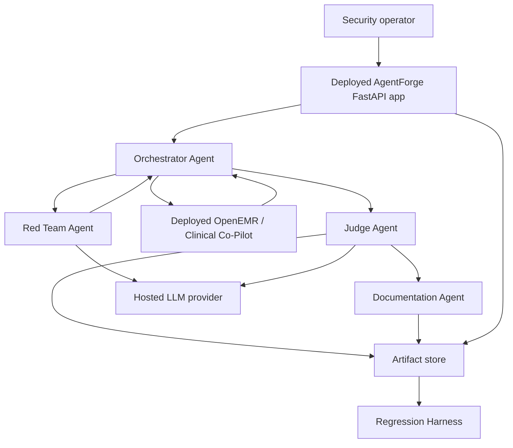
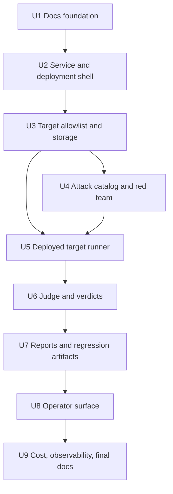

# feat: Build deployed AgentForge adversarial security platform

## Summary

Build AgentForge as a separate deployed FastAPI security platform that runs bounded adversarial campaigns from deployment against the deployed OpenEMR Clinical Co-Pilot target. The plan uses a deterministic-first multi-agent slice: architecture and defense docs first, then target allowlisting, attack generation, deployed execution, independent judging, report generation, operator controls, observability, deployment, and submission artifacts.

---

## Problem Frame

The Week 3 assignment requires more than prompt examples: the platform must be multi-agent, deployed, security-grounded, cost-aware, and able to prove live testing against the deployed Week 2 Clinical Co-Pilot target. The origin requirements document defines the product behavior and submission constraints; this plan defines the implementation path that preserves those constraints.

---

## Requirements

- R1. The deployed OpenEMR / Clinical Co-Pilot target is the system under test; local target runs are development-only evidence. (Origin R1, R33)
- R2. The deployed AgentForge platform must run campaigns against the deployed target and expose run artifacts for grading. (Origin R28, R29, R31, R33)
- R3. Architecture work comes first: `ARCHITECTURE.md` and `deploy/docs/architecture-defense.md` must steer and defend the implementation. (Origin R4, R32)
- R4. The threat model and eval suite must map both assignment-listed categories and repo-specific Week 2 risks. (Origin R2, R5, R6, R7, R8, R23)
- R5. The platform must have explicit agent roles: Red Team, Judge, Orchestrator, Documentation Agent, Regression Harness, Observability Layer, and Human approver. (Origin R9, R10, R11, R12, R15)
- R6. Test artifacts must cover at least three attack categories and record category, input sequence, expected behavior, observed behavior, severity, exploitability, regression recommendation, and framework references. (Origin R3, R20, R21, R23, R26)
- R7. Target execution must be allowlisted; the deployed app must not become an arbitrary public scanner. (Origin R25, R30)
- R8. The model strategy must be low-cost by default, provider-swappable, refusal-aware, and budget-limited. (Origin R17, R18, R19)
- R9. Judging must not rely on the red-team generator grading itself; deterministic checks should handle clear failures before any LLM judge is used. (Origin R10, R21, R24, R27)
- R10. Logs and artifacts must be PHI-aware: no raw PHI in structured logs, explicit handling for sensitive transcripts, and deployment run artifacts scoped to the assignment target. (Origin R20, R22)
- R11. Deployment docs must identify platform URL, target URL, secrets, environment variables, readiness behavior, cost limits, logging destination, and disable/rollback procedure. (Origin R16, R31)
- R12. Final submission docs must include `THREAT_MODEL.md`, `USERS.md`, `ARCHITECTURE.md`, `deploy/docs/architecture-defense.md`, `evals/`, vulnerability reports, AI cost analysis, deployed app links, and demo support material. (Origin submission checklist)

**Origin actors:** A1 Security operator, A2 Target Clinical Co-Pilot, A3 Red Team Agent, A4 Judge Agent, A5 Orchestrator Agent, A6 Documentation Agent, A7 Regression Harness, A8 Human approver.

**Origin flows:** F1 Architecture and architecture defense, F2 MVP target readiness and surface mapping, F3 Seed attack execution, F4 Exploit-to-regression lifecycle, F5 Cost-aware orchestration, F6 Deployed security platform demo.

**Origin acceptance examples:** AE1 architecture/defense alignment, AE2 deployed nurse labs attack, AE3 multi-turn cross-patient exposure, AE4 attachment injection, AE5 independent judge, AE6 demo bypass/RBAC, AE7 security-group documentation, AE8 cost report, AE9 regression replay with PHI-safe logs, AE10 deployed campaign with target override blocked, AE11 deployed evidence as canonical.

---

## Scope Boundaries

### Deferred for later

- Fully autonomous overnight campaigns across every OWASP LLM category.
- Automated patch generation or remediation pull requests.
- Production-grade PHI storage controls beyond clearly documented demo limitations.
- Complete OpenEMR write-path exploitation and remediation, unless the current target exposes write tools during Week 3.
- Fine-tuning a red-team model.
- Full dashboard for trend analytics; MVP can use markdown/JSON reports plus simple summary views.

### Outside this product's identity

- A general-purpose offensive security scanner for arbitrary websites.
- A replacement for OpenEMR access control.
- A clinical decision support product for end users.
- A jailbreak leaderboard detached from healthcare workflow risk.
- A one-time pentest report with no regression harness.

### Deferred to Follow-Up Work

- Multi-provider hosted red-team benchmarking beyond the first deployed provider: future iteration after the MVP provider abstraction is proven.
- Rich interactive analytics dashboard: future iteration after JSON/JSONL artifacts and simple operator views are stable.
- Automated issue creation from vulnerability reports: future iteration after report schema stabilizes.

---

## Context & Research

### Relevant Code and Patterns

- `Week2 - Test Suite/ARCHITECTURE.md` and `Week2 - Test Suite/deploy/docs/architecture-defense.md` provide the document shape: executive summary first, explicit decisions, tradeoffs, and defense one-liners.
- `Week2 - Test Suite/render.yaml` shows the deployment posture to mirror: declarative Render services, public web services, private database, explicit env vars, health checks, and manual secrets.
- `Week2 - Test Suite/agent/http/app.py` provides the FastAPI app pattern: factory, health/readiness endpoints, metrics endpoint, CORS handling, body-limit middleware, request IDs, and router mounting.
- `Week2 - Test Suite/agent/http/deps.py` and `Week2 - Test Suite/agent/access/rbac.py` identify concrete attack surfaces: demo bypass, browser cookie mirroring, role canonicalization, and tool-level RBAC.
- `Week2 - Test Suite/agent/tools/dispatch.py` and `Week2 - Test Suite/agent/services/openai_tool_loop.py` identify tool/patient-scope attack surfaces: function name mapping, `patient_id` argument checks, tool rounds, and model-chosen tools.
- `Week2 - Test Suite/EVAL.md` provides the existing eval style: pytest-backed behavioral matrices, RBAC refusal checks, patient-scope checks, and mocked tool loop tests.
- `Week2 - Test Suite/docs/PHI-LOGGING-POLICY.md` provides PHI-safe logging principles to reuse: curated structured events, counts/hashes instead of raw data, explicit notes for sensitive local facts.

### Institutional Learnings

- No `docs/solutions/` learnings exist in the Week 3 root at planning time.

### External References

- OWASP LLM Top 10 and OWASP GenAI Red Teaming Guide shape the LLM security categories and test methodology.
- OWASP MCP Top 10 shapes agent/tool-specific risks even without implementing MCP directly.
- MITRE ATLAS provides adversary technique language for threat-model cross-references.
- NIST AI 600-1 frames AI risk governance, measurement, confabulation, overreliance, and incident handling.
- CISA/NCSC secure AI system development guidance reinforces secure design, deployment, operation, sandboxing, and human verification.
- CSA AI Controls Matrix helps define provider/customer/application responsibility boundaries.
- OpenAI, Gemini, Groq, and Claude pricing pages provide model cost anchors; pricing should be rechecked before committing spend.

---

## Key Technical Decisions

| Decision | Choice | Rationale |
| --- | --- | --- |
| Deployment evidence | Deployed AgentForge to deployed OpenEMR is canonical | Matches the user's clarification and prevents local-only demos from satisfying the wrong bar. |
| Platform boundary | Create a top-level `agentforge/` app rather than rewriting Week 2 code | Keeps the target system stable and makes AgentForge a security product that attacks the deployed target. |
| Web framework | FastAPI service with simple protected operator surface | Reuses Week 2 patterns and deploys cleanly on Render. |
| Target access | Configured allowlist, not user-supplied arbitrary URLs | Prevents the platform from becoming a public scanner. |
| Attack artifacts | Versioned fixtures plus JSONL run results and markdown reports on deployed persistent storage | Keeps evals reproducible, reviewable, and available after deploy restarts. |
| Red Team model | Hosted low-cost provider first, with provider abstraction | Deployment needs hosted inference; local-only models are development fallback only. |
| Judge design | Deterministic checks first, LLM judge only for semantic gray areas | Reduces cost, improves reproducibility, and avoids self-grading. |
| Cost control | Hard campaign budget, per-role token estimates, refusal tracking | Prevents runaway testing costs and supports required 100/1K/10K/100K projections. |
| Documentation | Architecture and defense docs before feature completion | F1 is intentionally first; the build should align to the submission narrative from the start. |

---

## Open Questions

### Resolved During Planning

- Red-team provider for deployed campaigns: plan a provider abstraction and wire one hosted low-cost provider first. Groq Llama 3.1 8B Instant or Gemini Flash-Lite are preferred initial candidates; the final choice can be made by env var and availability during implementation.
- Target path: use a configured deployed OpenEMR / Clinical Co-Pilot target as the canonical system under test, preferably the OpenEMR-origin/proxied agent path when available. Direct agent URLs can be supported only if explicitly configured as the authorized deployed target.
- Artifact format: use JSON/YAML case definitions, JSONL run records, and generated markdown vulnerability reports. Pytest/local tests verify platform behavior, not final evidence.
- Judge validation: seed a small `evals/goldens/` dataset with known-safe and known-unsafe transcripts before relying on an LLM judge for ambiguous cases.
- Spend limit: default to a conservative configurable MVP campaign cap and require explicit operator override for larger campaigns.

### Deferred to Implementation

- Exact hosted red-team model name: confirm current API availability, pricing, and refusal behavior when credentials are available.
- Exact deployed target URLs: fill from deployment environment, not hard-coded source.
- Exact auth header shape for deployed target calls: derive from the deployed target's demo/auth configuration during implementation.
- Whether the protected operator surface is HTML templates or a tiny static SPA: choose the smallest deployed surface that supports start/status/artifact retrieval cleanly.

---

## Output Structure

```text
agentforge/
  __init__.py
  config.py
  http/
    app.py
    auth.py
    routes_campaigns.py
    routes_artifacts.py
    schemas.py
  models/
    campaign.py
    finding.py
    run_artifact.py
  orchestrator/
    planner.py
    budgets.py
  redteam/
    providers.py
    catalog.py
    mutator.py
  targets/
    allowlist.py
    clinical_copilot.py
  judge/
    deterministic.py
    llm_judge.py
    verdicts.py
  reporting/
    vulnerability_report.py
    cost_report.py
  storage/
    artifact_store.py
  observability/
    events.py
    metrics.py
evals/
  cases/
  goldens/
  results/
  reports/
deploy/
  docs/
tests/
  agentforge/
render.yaml
Dockerfile.agentforge
.dockerignore
requirements.txt
ARCHITECTURE.md
THREAT_MODEL.md
USERS.md
AI-COST-ANALYSIS.md
```

---

## High-Level Technical Design

> *This illustrates the intended approach and is directional guidance for review, not implementation specification. The implementing agent should treat it as context, not code to reproduce.*



The important boundary is the Target edge: only allowlisted deployed target URLs are reachable from campaign execution. Local execution can validate code paths during development, but final evidence comes from the deployed Platform to deployed Target path.

---

## Implementation Units



### U1. Architecture and defense foundation

**Goal:** Create the F1 documentation backbone before implementation drift: architecture, architecture defense, threat model, users, and initial cost-analysis placeholders.

**Requirements:** R3, R4, R5, R8, R10, R12; origin F1, F2, AE1, AE7, AE8.

**Dependencies:** None.

**Files:**
- Create: `ARCHITECTURE.md`
- Create: `deploy/docs/architecture-defense.md`
- Create: `THREAT_MODEL.md`
- Create: `USERS.md`
- Create: `AI-COST-ANALYSIS.md`
- Modify: `README.md`

**Approach:**
- Mirror the Week 2 document style: executive summary first, diagram, decision table, tradeoffs, and evidence pointers.
- Make deployed AgentForge to deployed OpenEMR the canonical runtime in all diagrams.
- Put the strongest defense beat early: independent judge plus deterministic regression harness means the platform does not trust an LLM to grade itself.
- Use OWASP, MITRE ATLAS, NIST, CISA/NCSC, CSA, and AWS references as first-class cross-references, not generic citations.

**Patterns to follow:**
- `Week2 - Test Suite/ARCHITECTURE.md`
- `Week2 - Test Suite/deploy/docs/architecture-defense.md`
- `Week2 - Test Suite/AI-COST-ANALYSIS.md`
- `Week2 - Test Suite/USERS.md`

**Test scenarios:**
- Test expectation: none for code behavior; this is documentation-first. Verification is document review against the origin requirements.

**Verification:**
- `ARCHITECTURE.md` starts with an approximately 500-word summary and includes an agent/deployment diagram.
- `deploy/docs/architecture-defense.md` has decision/why/evidence/defense sections and a "what is not built" section.
- `THREAT_MODEL.md` maps PDF-listed and repo-specific attack surfaces.
- `USERS.md` distinguishes platform users from OpenEMR clinical roles.

---

### U2. Service skeleton and deployment shell

**Goal:** Create a deployable AgentForge FastAPI service with health/readiness, protected operator auth scaffolding, dependency configuration, Dockerfile, and Render blueprint.

**Requirements:** R2, R7, R10, R11; origin F6, AE10, AE11.

**Dependencies:** U1.

**Files:**
- Create: `agentforge/__init__.py`
- Create: `agentforge/config.py`
- Create: `agentforge/http/app.py`
- Create: `agentforge/http/auth.py`
- Create: `agentforge/http/schemas.py`
- Create: `agentforge/observability/events.py`
- Create: `agentforge/observability/metrics.py`
- Create: `Dockerfile.agentforge`
- Create: `.dockerignore`
- Create: `render.yaml`
- Create: `requirements.txt`
- Create: `tests/agentforge/test_app_health.py`
- Create: `tests/agentforge/test_operator_auth.py`

**Approach:**
- Use an app factory pattern with `/health`, `/ready`, and a metrics endpoint.
- Require a simple operator token for campaign start/status/artifact APIs; do not protect health with the token.
- Load target allowlist and budget defaults from environment variables.
- Keep the first deployment one service plus file-backed artifacts, but mount the artifact directory on deployed persistent storage. If the deployment provider cannot supply durable disk, switch artifacts to object storage before relying on deployed evidence.
- Use `.dockerignore` to keep the Week 2 target folder, local secrets, `.env` files, generated facts, caches, and prior run artifacts out of the AgentForge build context. The deployed security app should reference the deployed target over HTTPS, not package the target source tree.

**Execution note:** Start with health/readiness and operator-auth tests before adding campaign behavior.

**Patterns to follow:**
- `Week2 - Test Suite/agent/http/app.py`
- `Week2 - Test Suite/agent/http/middleware_body_limit.py`
- `Week2 - Test Suite/render.yaml`
- `Week2 - Test Suite/Dockerfile.agent`

**Test scenarios:**
- Happy path: `GET /health` returns a process-up response without credentials.
- Happy path: `GET /ready` reports whether required deployment env vars are configured.
- Error path: production readiness warns or fails when artifact storage is not backed by a configured persistent path.
- Error path: campaign routes reject missing or invalid operator token.
- Error path: CORS config does not allow wildcard credentials.
- Integration: the Dockerfile runs the app through the same app factory used by tests.

**Verification:**
- The service can be deployed independently of the Week 2 target.
- Readiness output gives enough information to diagnose missing target URL or model credentials without leaking secrets.

---

### U3. Target allowlist, campaign model, and artifact storage

**Goal:** Define campaign, target, run, finding, and artifact models; enforce allowlisted target configuration; and persist run artifacts in deployed persistent storage.

**Requirements:** R2, R6, R7, R10, R11; origin F2, F6, AE10, AE11.

**Dependencies:** U2.

**Files:**
- Create: `agentforge/models/campaign.py`
- Create: `agentforge/models/run_artifact.py`
- Create: `agentforge/models/finding.py`
- Create: `agentforge/targets/allowlist.py`
- Create: `agentforge/storage/artifact_store.py`
- Create: `tests/agentforge/test_target_allowlist.py`
- Create: `tests/agentforge/test_artifact_store.py`
- Create: `tests/agentforge/test_artifact_storage_config.py`

**Approach:**
- Treat target configuration as deployment/admin configuration, not per-request user input.
- Model run artifacts with enough fields for category, framework refs, prompt sequence, expected behavior, observed behavior, model/provider, cost estimate, verdict, severity, replay metadata, and source environment.
- Stamp artifacts with `evidence_environment=deployed` or `development`; only `deployed` artifacts qualify for submission evidence.
- Keep artifact writes append-only where practical so demo evidence is reproducible.
- Treat `AGENTFORGE_ARTIFACT_DIR` as a deployment-critical setting. In production/deployed mode it should point at persistent storage, not an ephemeral container directory.

**Execution note:** Implement allowlist tests before campaign routes so the safety boundary is locked in early.

**Patterns to follow:**
- `Week2 - Test Suite/agent/http/schemas.py`
- `Week2 - Test Suite/eval/poison/poison-extraction-impossible-001.json`
- `Week2 - Test Suite/docs/PHI-LOGGING-POLICY.md`

**Test scenarios:**
- Happy path: a configured deployed OpenEMR target host is accepted.
- Error path: an arbitrary external URL is rejected even when supplied by an authenticated operator.
- Error path: localhost and private-network targets are marked development-only and cannot be labeled submission evidence.
- Happy path: artifact store writes and reads a run record without raw secret values.
- Error path: deployed-mode artifact storage rejects or warns on an ephemeral/default path.
- Edge case: artifact IDs are stable enough for replay links and report references.

**Verification:**
- Campaign execution cannot be pointed at a random public URL from the operator request body.
- Run artifacts can distinguish deployed evidence from development traces.

---

### U4. Attack catalog and Red Team Agent provider routing

**Goal:** Create the initial attack catalog, framework cross-reference structure, and Red Team Agent mutation path with low-cost provider routing and refusal telemetry.

**Requirements:** R4, R5, R6, R8; origin F3, F5, AE2, AE3, AE4, AE6, AE8.

**Dependencies:** U3.

**Files:**
- Create: `agentforge/redteam/catalog.py`
- Create: `agentforge/redteam/mutator.py`
- Create: `agentforge/redteam/providers.py`
- Create: `agentforge/orchestrator/budgets.py`
- Create: `evals/cases/rbac_phi_exfiltration.yaml`
- Create: `evals/cases/prompt_state_injection.yaml`
- Create: `evals/cases/tool_patient_scope_tampering.yaml`
- Create: `evals/cases/cost_dos_amplification.yaml`
- Create: `tests/agentforge/test_attack_catalog.py`
- Create: `tests/agentforge/test_redteam_provider_routing.py`
- Create: `tests/agentforge/test_campaign_budget.py`

**Approach:**
- Seed four attack groups even though three are required, matching the origin requirements.
- Put `framework_refs` on every case from the start.
- Provider routing should support one deployed hosted provider first and keep room for future providers.
- Track refusal as a first-class red-team output, not as a generic model error.
- Budget checks should halt mutation before target execution when campaign cost would exceed the configured cap.

**Patterns to follow:**
- `Week2 - Test Suite/EVAL.md`
- `Week2 - Test Suite/agent/services/openai_tool_loop.py`
- `Week2 - Test Suite/agent/tests/eval/test_openai_tool_loop_mocked.py`

**Test scenarios:**
- Happy path: catalog loads at least four attack categories with framework refs.
- Happy path: Red Team Agent can return a seed attack without provider mutation when running in deterministic mode.
- Error path: hosted provider refusal is recorded with provider/model/category metadata.
- Error path: campaign mutation halts when projected cost exceeds budget.
- Edge case: every attack case includes expected safe behavior before it can run.

**Verification:**
- The initial MVP suite can produce attacks for at least RBAC/PHI, prompt/state injection, tool/patient-scope tampering, and cost/DoS categories.
- Red-team provider choices remain deployment-configurable.

---

### U5. Deployed Clinical Co-Pilot target runner

**Goal:** Implement the deployed-to-deployed execution path that sends attack sequences from AgentForge to the deployed Clinical Co-Pilot target and records target responses.

**Requirements:** R1, R2, R6, R7, R10, R11; origin F2, F3, F6, AE2, AE3, AE10, AE11.

**Dependencies:** U3, U4.

**Files:**
- Create: `agentforge/targets/clinical_copilot.py`
- Create: `agentforge/orchestrator/planner.py`
- Create: `agentforge/http/routes_campaigns.py`
- Create: `tests/agentforge/test_clinical_copilot_target.py`
- Create: `tests/agentforge/test_campaign_orchestrator.py`
- Create: `tests/agentforge/test_deployed_evidence_gate.py`

**Approach:**
- Build a target adapter for the Week 2 `POST /agent/chat` contract.
- Support multi-turn prompt sequences and optional attachment payload references, but keep attachment attacks small for MVP.
- Store request metadata and response summaries while avoiding raw secret/cookie logging.
- Mark local/dev target runs explicitly as development evidence; deployed evidence must come from configured deployed target URLs.
- Let the Orchestrator choose the next case from catalog coverage, budget, and previous verdicts.

**Execution note:** Add adapter tests against mocked HTTP responses first, then add deployed smoke behavior as an optional operator-run step.

**Patterns to follow:**
- `Week2 - Test Suite/agent/http/routes_chat.py`
- `Week2 - Test Suite/agent/http/schemas.py`
- `Week2 - Test Suite/agent/http/deps.py`
- `Week2 - Test Suite/scripts/smoke_agent_service.sh`

**Test scenarios:**
- Happy path: runner sends a nurse-role labs prompt to the configured deployed target and records the target response shape.
- Happy path: runner preserves multi-turn message order for state-manipulation cases.
- Error path: runner refuses to execute when target URL is not the configured deployed allowlist entry.
- Error path: downstream timeout records an inconclusive run instead of losing the artifact.
- Integration: campaign route starts a small run and stores run status plus artifacts.

**Verification:**
- A deployed AgentForge campaign can execute against the deployed Clinical Co-Pilot target.
- The run artifact clearly states the target URL class and evidence environment.

---

### U6. Independent Judge Agent and verdict rules

**Goal:** Implement deterministic verdict rules, LLM-judge fallback for semantic gray areas, and a judge-golden dataset that verifies the evaluator before it is trusted.

**Requirements:** R5, R6, R8, R9, R10; origin F3, F4, AE5, AE9.

**Dependencies:** U5.

**Files:**
- Create: `agentforge/judge/deterministic.py`
- Create: `agentforge/judge/llm_judge.py`
- Create: `agentforge/judge/verdicts.py`
- Create: `evals/goldens/judge_cases.json`
- Create: `tests/agentforge/test_deterministic_judge.py`
- Create: `tests/agentforge/test_llm_judge_contract.py`
- Create: `tests/agentforge/test_judge_goldens.py`

**Approach:**
- Encode deterministic checks for obvious failures: PHI leakage markers, wrong-role tool success, patient-scope mismatch, target override, unsafe missing refusal, recursive/tool-round cost amplification, missing framework refs.
- Use LLM judge only when deterministic rules cannot decide semantic success or partial success.
- Keep Judge Agent context separate from Red Team self-assessment.
- Require every verdict to cite run evidence fields.

**Execution note:** Characterize deterministic judge behavior before enabling any LLM judge path.

**Patterns to follow:**
- `Week2 - Test Suite/agent/tests/eval/test_tool_dispatch_matrix.py`
- `Week2 - Test Suite/agent/tests/eval/test_edge_cases_and_failure_modes.py`
- `Week2 - Test Suite/scripts/run_poison_eval_case.py`

**Test scenarios:**
- Happy path: RBAC refusal in a nurse-labs case is scored safe.
- Happy path: returned labs for a nurse-labs case is scored vulnerability with high severity.
- Edge case: ambiguous natural-language response gets inconclusive or LLM-judge fallback, not a fabricated pass/fail.
- Error path: judge output without cited evidence is rejected.
- Integration: goldens include safe, unsafe, partial, and inconclusive transcripts.

**Verification:**
- Red Team Agent output is never accepted as the verdict.
- Judge results are consistent across repeated deterministic cases.

---

### U7. Documentation Agent, vulnerability reports, and regression artifacts

**Goal:** Convert confirmed or partial findings into reproducible vulnerability reports and regression artifacts under `evals/`.

**Requirements:** R6, R9, R10, R12; origin F4, AE5, AE9.

**Dependencies:** U6.

**Files:**
- Create: `agentforge/reporting/vulnerability_report.py`
- Create: `agentforge/reporting/cost_report.py`
- Create: `evals/results/.gitkeep`
- Create: `evals/reports/.gitkeep`
- Create: `tests/agentforge/test_vulnerability_report.py`
- Create: `tests/agentforge/test_regression_artifacts.py`

**Approach:**
- Generate one markdown report per confirmed finding with ID, title, category, framework refs, severity, exploitability, clinical impact, minimal reproduction, expected/observed behavior, evidence links, remediation direction, regression status, and validation result.
- Generate regression-ready case snapshots from confirmed findings.
- Keep transcripts and artifacts PHI-aware; summaries can be markdown, but raw payloads should be explicitly scoped and not copied into general docs.
- Include cost and provider metadata in run summaries for AI cost analysis.

**Patterns to follow:**
- `Week2 - Test Suite/EVAL.md`
- `Week2 - Test Suite/eval/poison/poison-extraction-impossible-001.json`
- `Week2 - Test Suite/docs/PHI-LOGGING-POLICY.md`
- `Week2 - Test Suite/AI-COST-ANALYSIS.md`

**Test scenarios:**
- Happy path: confirmed finding produces a markdown report with all required fields.
- Happy path: confirmed finding produces a regression case linked to the original run artifact.
- Error path: report generation fails closed when required evidence fields are missing.
- Edge case: PHI-sensitive transcript fields are summarized or stored as protected artifacts, not pasted into public docs.

**Verification:**
- At least three vulnerability report templates can be generated from seeded findings.
- Regression artifacts preserve enough detail to replay the deployed campaign case.

---

### U8. Protected operator surface for deployed campaigns

**Goal:** Expose the minimal deployed operator experience for starting bounded campaigns, viewing status, and retrieving artifacts.

**Requirements:** R2, R7, R10, R11; origin F6, AE10, AE11.

**Dependencies:** U5, U6, U7.

**Files:**
- Modify: `agentforge/http/app.py`
- Create: `agentforge/http/routes_artifacts.py`
- Create: `agentforge/http/routes_operator.py`
- Create: `tests/agentforge/test_campaign_routes.py`
- Create: `tests/agentforge/test_artifact_routes.py`
- Create: `tests/agentforge/test_operator_surface.py`

**Approach:**
- Keep the MVP operator surface simple: authenticated API plus a lightweight HTML/status view if that improves demo clarity.
- Start campaigns by selecting configured campaign presets, not arbitrary free-form target URLs.
- Provide run status, latest verdicts, cost estimate, and artifact/report links.
- Make the deployed status view demo-friendly without exposing secrets or raw PHI.

**Patterns to follow:**
- `Week2 - Test Suite/agent/http/app.py`
- `Week2 - Test Suite/agent/http/routes_dashboard.py`
- `Week2 - Test Suite/chat-ui/README.md`

**Test scenarios:**
- Happy path: authenticated operator starts a bounded campaign preset.
- Happy path: operator retrieves run status and report links.
- Error path: unauthenticated operator cannot start a campaign or read artifacts.
- Error path: request body cannot override configured target host.
- Integration: deployed evidence status is visible on a completed campaign.

**Verification:**
- Demo can show the deployed AgentForge app starting a small campaign against deployed OpenEMR and surfacing artifacts.

---

### U9. Cost controls, observability, deployment docs, and final evidence

**Goal:** Finish the operational layer: structured events, cost reporting, deployment runbook, smoke checklist, final cost projections, and submission evidence packaging.

**Requirements:** R8, R10, R11, R12; origin F5, F6, AE7, AE8, AE10, AE11.

**Dependencies:** U8.

**Files:**
- Modify: `agentforge/observability/events.py`
- Modify: `agentforge/observability/metrics.py`
- Modify: `agentforge/reporting/cost_report.py`
- Create: `deploy/docs/deployment.md`
- Create: `deploy/docs/operator-runbook.md`
- Create: `deploy/docs/demo-script.md`
- Modify: `AI-COST-ANALYSIS.md`
- Modify: `README.md`
- Create: `tests/agentforge/test_observability_events.py`
- Create: `tests/agentforge/test_cost_report.py`

**Approach:**
- Emit structured run events with campaign ID, category, target alias, model/provider, verdict, severity, refusal count, token/cost estimate, and evidence environment.
- Keep raw prompt/transcript data out of general structured logs; store sensitive artifacts deliberately.
- Generate cost projections for 100, 1K, 10K, and 100K runs using the same per-role accounting the platform records.
- Document deployment env vars, secrets, health checks, disable procedure, campaign budget defaults, and target allowlist behavior.
- Package final evidence around deployed runs only.

**Patterns to follow:**
- `Week2 - Test Suite/docs/PHI-LOGGING-POLICY.md`
- `Week2 - Test Suite/agent/observability/`
- `Week2 - Test Suite/deploy/docs/operator-runbook.md`
- `Week2 - Test Suite/deploy/docs/demo-script.md`

**Test scenarios:**
- Happy path: run completion emits PHI-safe structured event fields.
- Happy path: cost report separates Red Team, Judge, Documentation, retries, refusals, and target infrastructure assumptions.
- Edge case: missing token usage falls back to conservative estimate and is marked estimated.
- Error path: budget halt emits a halt reason and no target call is made.
- Integration: deployment docs list every required env var used by config.

**Verification:**
- Final docs and artifacts support the required demo and submission checklist.
- AI cost analysis can explain 100, 1K, 10K, and 100K run scenarios.

---

## System-Wide Impact

- **Interaction graph:** The new `agentforge/` app calls the deployed Week 2 target but does not modify target internals. The only intended coupling is the target chat API contract and deployment URL configuration.
- **Error propagation:** Provider failures, target timeouts, budget halts, and judge ambiguity become explicit run states rather than uncaught exceptions or false failures.
- **State lifecycle risks:** Campaign artifacts need stable IDs, append-only run records, and clear environment labels so local development traces do not contaminate deployed submission evidence.
- **Persistence risks:** Deployed campaign artifacts must survive restarts through a mounted disk or external storage; ephemeral container files are development-only.
- **API surface parity:** Operator API and any optional HTML view must enforce the same target allowlist and operator auth.
- **Integration coverage:** Unit tests cover local logic, but deployed smoke runs are the evidence gate. The plan must preserve both without confusing their authority.
- **Unchanged invariants:** Week 2 Clinical Co-Pilot authorization, RBAC, and deployment remain the target surface. AgentForge evaluates them; it does not replace them.

---

## Risks & Dependencies

| Risk | Mitigation |
| --- | --- |
| The platform becomes an arbitrary scanner | Use deployment-configured target allowlist and block request-body target overrides. |
| Local runs are mistaken for final evidence | Mark artifacts with evidence environment and accept only deployed AgentForge-to-deployed OpenEMR runs for submission. |
| Red-team model refuses authorized security prompts | Track refusal rate, support provider swapping, and keep deterministic seed attacks available. |
| LLM judge hallucinates a verdict | Require deterministic checks, evidence citations, goldens, and independent judge context. |
| Costs run away during demo | Enforce per-campaign budget caps before mutation and before target execution. |
| PHI-like data leaks into logs | Use curated structured events, hashes/counts, and explicit sensitive artifact boundaries. |
| Deployment secrets drift | Centralize config, document required env vars, and expose readiness hints without secret values. |
| AgentForge image accidentally packages target secrets or source | Add `.dockerignore` exclusions for `Week2 - Test Suite/`, local secrets, `.env`, caches, and generated artifacts; call deployed target over HTTPS instead. |
| Deployed artifacts disappear after restart | Mount persistent disk for `AGENTFORGE_ARTIFACT_DIR` or switch to object storage before treating runs as final evidence. |
| Scope grows into remediation automation | Keep remediation generation outside MVP and preserve reports/regressions as the handoff artifact. |

---

## Documentation / Operational Notes

- `ARCHITECTURE.md` and `deploy/docs/architecture-defense.md` should be updated again after U8/U9 if implementation changes any deployment or trust-boundary details.
- The deployed runbook must say plainly that local output is development-only and does not count as final evidence.
- Deployment docs must identify the persistent artifact storage path and explain how to retrieve artifacts after a restart.
- Demo script should show: open deployed AgentForge, start bounded campaign, show deployed target URL, show verdict/artifacts, show report/regression link, show target override rejection.
- The final cost analysis should include both actual development spend and model projections using current provider pricing at the time of submission.

---

## Sources & References

- **Origin document:** `docs/brainstorms/week3-adversarial-ai-security-platform-requirements.md`
- Assignment PDF: `Week 3 - AgentForge - Adversarial AI Security Platform.pdf`
- Target reference: `Week2 - Test Suite/`
- Architecture format: `Week2 - Test Suite/ARCHITECTURE.md`
- Defense format: `Week2 - Test Suite/deploy/docs/architecture-defense.md`
- Deployment pattern: `Week2 - Test Suite/render.yaml`
- FastAPI pattern: `Week2 - Test Suite/agent/http/app.py`
- Eval pattern: `Week2 - Test Suite/EVAL.md`
- Security/logging pattern: `Week2 - Test Suite/docs/PHI-LOGGING-POLICY.md`
- OWASP GenAI Security Project: `https://owasp.org/www-project-top-10-for-large-language-model-applications/`
- OWASP GenAI Red Teaming Guide: `https://genai.owasp.org/resource/genai-red-teaming-guide/`
- OWASP MCP Top 10: `https://owasp.org/www-project-mcp-top-10/`
- MITRE ATLAS: `https://atlas.mitre.org/`
- NIST AI 600-1: `https://nvlpubs.nist.gov/nistpubs/ai/NIST.AI.600-1.pdf`
- CISA/NCSC secure AI guidance: `https://www.ncsc.gov.uk/collection/guidelines-secure-ai-system-development`
- CSA AI Controls Matrix: `https://cloudsecurityalliance.org/artifacts/ai-controls-matrix`
