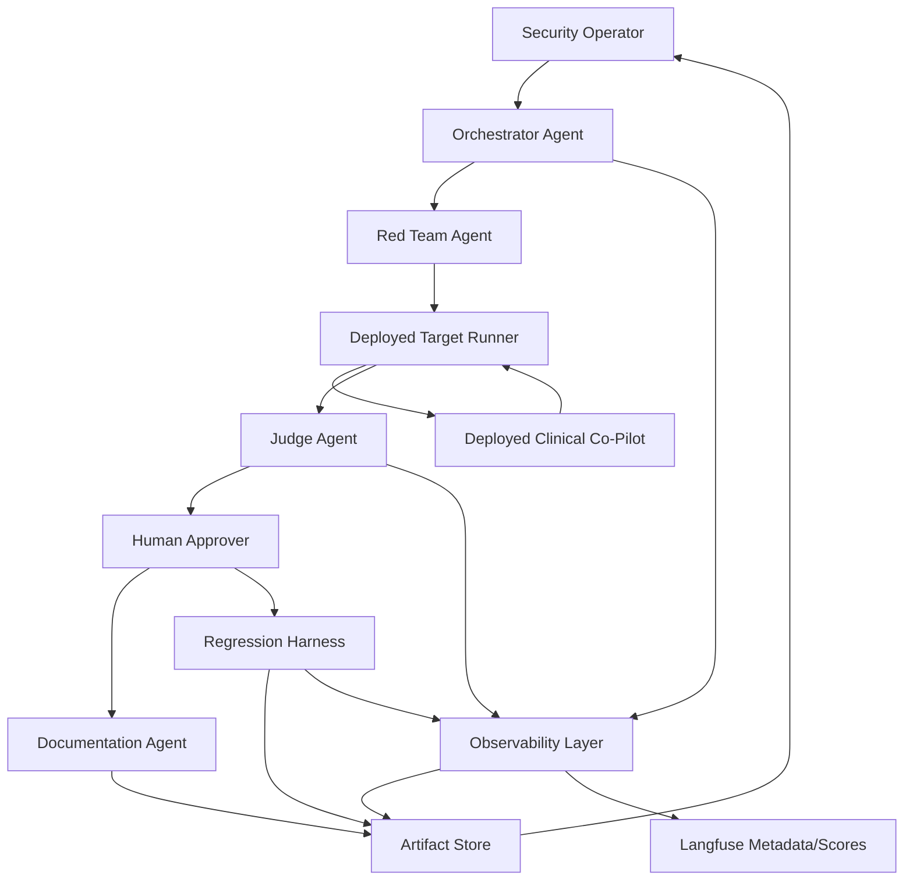
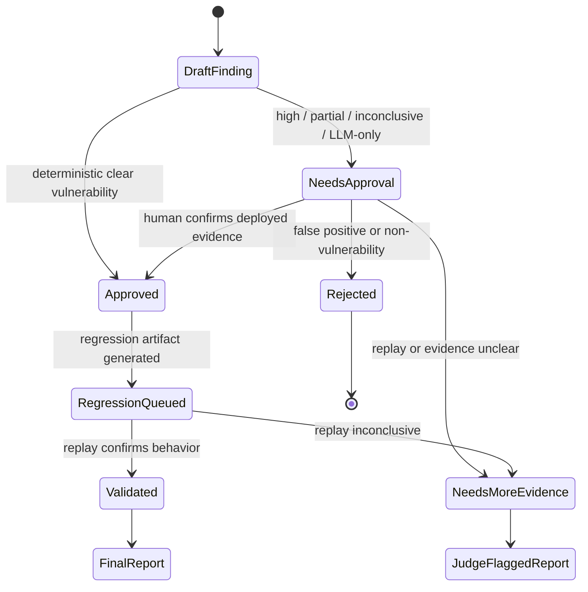
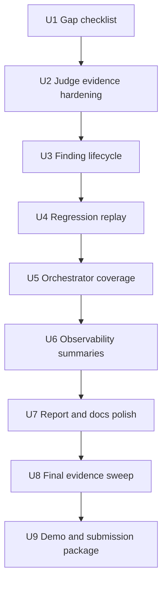

# feat: Complete AgentForge final submission platform requirements

## Summary

Finish AgentForge from MVP-complete to final-submission-complete by closing every requirement in the PDF's Platform Requirements section: multi-agent behavior, mutation, independent judging, coverage-driven orchestration, regression replay, observability, professional reports, deployed evidence, and submission packaging. This plan preserves the existing deployed FastAPI platform and focuses on hardening the pieces that must be defensible in a final review.

---

## Problem Frame

The MVP already proves the core path: a deployed AgentForge service can run bounded campaigns against the deployed Week 2 Clinical Co-Pilot target and persist artifacts. The final submission bar is higher: the Platform Requirements require the system to behave like a multi-agent adversarial evaluation platform, not just a static runner with documentation.

The highest-risk gap is evidence quality. Current artifacts include useful deployed runs, reports, and regression files, but several findings are unapproved or look like deterministic judge false positives where the target refused safely and the judge matched unsafe terms in echoed prompt text. These should still be counted in the submission as judge-flagged vulnerabilities, but they must live in a separate "unconfirmed / needs-more-evidence" lane from confirmed vulnerabilities so the final package is honest about confidence, status, and validation.

---

## Assumptions

*This plan was authored without a synchronous confirmation round. The items below are inferred from the PDF, origin requirements, and current repo state.*

- The final submission should maintain two report lanes: confirmed vulnerabilities and judge-flagged vulnerabilities. Judge false positives can count as vulnerability reports only in the clearly labeled judge-flagged/unconfirmed lane.
- The existing deployed service at `https://agentforge-security.onrender.com` and target at `https://clinical-copilot-4kwb.onrender.com` remain the intended final demo surfaces.
- The implementation should stay within the existing FastAPI, JSON/YAML artifact, deterministic-first, Langfuse-backed architecture rather than introducing a new agent framework this late.
- Code changes should touch AgentForge and submission docs only; `Week2 - Test Suite/` remains the stable system under test.
- "Automatic regression runs" can be implemented as an operator-triggered and target-version-triggerable harness for final submission; a production scheduler is deferred.

---

## Requirements

- R1. The platform must be explicitly multi-agent: Red Team, Judge, Orchestrator, Documentation Agent, Regression Harness, Observability Layer, and Human Approver have distinct responsibilities, context, inputs, outputs, trust levels, and coordination paths. (Origin R4, R9-R12, R15; PDF Platform Requirements)
- R2. The Red Team Agent must generate or mutate adversarial inputs, including multi-turn sequences and variants from partial successes, while remaining scoped to allowlisted deployed targets. (Origin R7-R9, R17-R18, R25; AE3, AE4, AE5)
- R3. The Judge Agent must evaluate independently with consistent criteria, separate response content from echoed attack text, cite evidence, and escalate uncertainty rather than invent certainty. (Origin R10, R21, R24, R27; AE5, AE9)
- R4. The Orchestrator Agent must prioritize coverage gaps, weak surfaces learned from prior campaigns, unresolved/high-severity findings, regressions, refusal rate, and cost signals; it must halt or redirect when spend accumulates without signal and trigger regression replay when the target changes. (Origin R11, R19-R21; AE8, AE9)
- R5. The Documentation Agent must produce professional vulnerability reports with unique ID, severity, clinical impact, minimal reproduction, expected versus observed behavior, remediation direction, current status, fix validation result, and an explicit confidence lane: confirmed or judge-flagged/unconfirmed. (Origin R12, R26, R27)
- R6. The Regression & Validation Harness must store confirmed exploits in a versioned, queryable format, replay them deterministically, distinguish behavior drift from actual fixes, and flag reappearing vulnerabilities or cross-category regressions. (Origin R20-R21, R26; AE9)
- R7. The Observability Layer must answer the PDF's required questions: categories tested, cases per category, pass/fail rate by category/version, resilience trend, open/in-progress/resolved vulnerabilities, run cost and cost scaling, and agent activity order. (Origin R20-R22; AE8, AE9)
- R8. Deployed evidence must remain canonical: final artifacts must come from deployed AgentForge running against the deployed Clinical Co-Pilot target, with local runs labeled development-only. (Origin R1, R28-R33; AE2, AE10, AE11)
- R9. Final submission packaging must include the GitHub/GitLab repository, setup guide, architecture overview, deployed links, run instructions, threat model, users doc, architecture doc, demo video, eval dataset, at least three defensible vulnerability reports, AI cost analysis, deployed applications, and final social post. (Origin submission checklist)

**Origin actors:** A1 Security operator, A2 Target Clinical Co-Pilot, A3 Red Team Agent, A4 Judge Agent, A5 Orchestrator Agent, A6 Documentation Agent, A7 Regression Harness, A8 Human approver.

**Origin flows:** F1 Architecture and architecture defense, F2 target readiness and surface mapping, F3 seed attack execution, F4 exploit-to-regression lifecycle, F5 cost-aware orchestration, F6 deployed security platform demo.

**Origin acceptance examples:** AE1 architecture/defense alignment, AE2 deployed nurse labs attack, AE3 multi-turn cross-patient exposure, AE4 attachment injection, AE5 independent judge, AE6 demo bypass/RBAC, AE7 security-group documentation, AE8 cost report, AE9 regression replay with PHI-safe logs, AE10 deployed campaign with target override blocked, AE11 deployed evidence as canonical.

---

## Scope Boundaries

### Deferred for later

- Fully autonomous overnight campaigns across every OWASP LLM category.
- Automated patch generation or remediation pull requests.
- Production-grade PHI storage controls beyond clearly documented demo limitations.
- Complete OpenEMR write-path exploitation and remediation, unless the current target exposes write tools during final evidence collection.
- Fine-tuning a red-team model.
- Full dashboard for trend analytics; final submission can use API/status views, JSON artifacts, markdown reports, and demo narration.

### Outside this product's identity

- A general-purpose offensive security scanner for arbitrary websites.
- A replacement for OpenEMR access control.
- A clinical decision support product for end users.
- A jailbreak leaderboard detached from healthcare workflow risk.
- A one-time pentest report with no regression harness.

### Deferred to Follow-Up Work

- Production scheduler for recurring regression jobs: leave behind an operator/API-triggerable regression harness and document the target-change trigger point.
- Rich UI analytics dashboard: expose the required observability answers through artifacts/status endpoints and docs for final submission.
- Automated remediation issue filing: keep reports actionable, but do not auto-create remediation tickets unless time remains after final evidence is approved.
- Provider bakeoff across multiple live red-team models: keep provider routing swappable and record refusal telemetry, but do not spend final-submission time benchmarking vendors unless the first live provider blocks evidence collection.

---

## Context & Research

### Relevant Code and Patterns

- `agentforge/orchestrator/campaigns.py` already coordinates catalog selection, target execution, deterministic judging, optional LLM judge fallback, report generation, regression creation for auto-approved findings, Langfuse recording, and artifact persistence.
- `agentforge/judge/deterministic.py` already has deterministic refusal and unsafe-indicator checks, but it currently evaluates one combined text excerpt, which can misclassify a safe refusal that repeats attacker-controlled text.
- `agentforge/reporting/vulnerability_report.py` renders reports and regression cases, but reports are sparse compared with the PDF's required clinical impact, minimal reproduction, expected/observed behavior, remediation, status, and validation fields.
- `agentforge/http/routes_approvals.py` supports approval, rejection, and `needs_more_evidence`, but final artifacts need consistent status/report/regression regeneration after approval decisions.
- `agentforge/storage/artifact_store.py` provides JSON/JSONL persistence for runs, findings, reports, regression cases, and goldens; this should remain the submission source of truth.
- `agentforge/observability/langfuse_client.py` emits metadata-only payloads, but it needs stronger coverage/pass-rate/cost/activity summaries to satisfy the Observability Layer requirements.
- `evals/cases/` currently contains five seed cases across RBAC/PHI, prompt-state injection, tool patient-scope tampering, attachment injection, and cost/DoS.
- `evals/results/` currently includes deployed and development runs. Deployed runs are canonical; development runs must remain labeled non-submission.
- `tests/agentforge/` already covers service shell, target allowlist, target runner, campaign routes, approval routes, artifact routes, red-team provider routing, deterministic judge behavior, judge goldens, Langfuse metadata, and cost report basics.

### Current Coverage Snapshot

- Deployed service and target health/readiness are already documented in `README.md` and `deploy/docs/mvp-submission-runbook.md`.
- Two deployed runs exist: one safe RBAC run and one four-case deployed campaign with four findings.
- Several current findings are still `needs_approval`; at least two appear likely to be deterministic false positives caused by unsafe indicators appearing in safe refusal text.
- Current report markdown files exist, but they do not yet meet the full report bar from the Documentation Agent section.
- Regression files exist, but there is not yet a clear replay harness that can run the regression set on target-version change and distinguish fixed behavior from model drift.
- `AI-COST-ANALYSIS.md` has LLM projections, but infrastructure estimates are still `TBD` and the actual-dev-spend table should be updated after final evidence review.

### Institutional Learnings

- No `docs/solutions/` learnings were found in this repo. The plan leans on the Week 2 architecture, eval, deployment, and PHI-logging patterns instead.

### External References

- OWASP GenAI Security Project and OWASP LLM Top 10 are the security taxonomy baseline for prompt injection, sensitive disclosure, excessive agency, and unbounded consumption. The OWASP project page describes the GenAI Security Project as guidance for secure generative AI development and governance.
- NIST AI 600-1 is the governance and measurement baseline. NIST describes it as a cross-sectoral profile and companion to the AI RMF for design, development, use, and evaluation of generative AI systems.
- Langfuse scores are appropriate for verdicts, severity, approval status, and later human/automated review because Langfuse supports UI, annotation queue, API/SDK, and LLM-as-judge scoring workflows.

---

## Key Technical Decisions

- Keep deterministic-first architecture: final completion should improve deterministic checks and evidence quality rather than making LLM judging the default.
- Treat unsafe-indicator matching as structured evidence analysis, not raw substring search over an entire response blob.
- Count reports in two explicit lanes: confirmed vulnerabilities for approved/replayable deployed findings, and judge-flagged vulnerabilities for false-positive-prone or needs-more-evidence findings. The second lane is allowed to count toward report inventory only when the report clearly labels its unconfirmed status.
- Add a regression replay harness instead of only generating regression JSON. The harness is the proof that a finding is repeatable and that fixes can be validated.
- Add coverage and status summaries to the operator/API layer instead of building a large dashboard. The PDF asks for visibility, not necessarily a polished analytics UI.
- Keep Langfuse metadata-only by default; raw transcripts stay in controlled artifacts to preserve the PHI-safe logging boundary.
- Final submission work should culminate in a single checklist document that maps each Platform Requirements bullet and submission deliverable to a file, deployed URL, run ID, report ID, or demo timestamp.

---

## Open Questions

### Resolved During Planning

- Whether false positives should count as vulnerability reports: yes, but only in a separate judge-flagged/unconfirmed vulnerability lane with status, confidence, and validation caveats visible in the report and checklist.
- Whether to introduce LangGraph/CrewAI/AutoGen now: no; the current code already defines distinct agent roles and is late-stage. Architecture should document custom FastAPI/Pydantic/artifact-state coordination as the agent framework.
- Whether final evidence can be local: no; only deployed AgentForge to deployed Clinical Co-Pilot artifacts count.
- Whether regression automation must be a production cron: no; for final submission it must be a runnable harness and documented target-change trigger point.

### Deferred to Implementation

- Exact final deployed run IDs and finding IDs: collect them during the final evidence sweep.
- Exact three or more final vulnerability reports: choose after replay and human approval confirm which deployed findings are defensible.
- Whether live Groq mutation is needed for the final campaign: use deterministic seed mode if it yields enough defensible evidence; enable live mutation only if final evidence coverage is thin.
- Exact social-post wording and demo-video link: finalize after recording the final run and choosing the submission artifacts.

---

## High-Level Technical Design

> *This illustrates the intended approach and is directional guidance for review, not implementation specification. The implementing agent should treat it as context, not code to reproduce.*

Final evidence should follow this state flow. Confirmed and judge-flagged reports are both retained, but they diverge before final packaging:

---

## Implementation Units

### U1. Build the Platform Requirements gap checklist

**Goal:** Create a final-submission checklist that maps every Platform Requirements bullet and submission requirement to current evidence, missing work, and acceptance criteria.

**Requirements:** R1-R9; origin F1-F6, AE1-AE11.

**Dependencies:** None.

**Files:**
- Create: `SUBMISSION.md`
- Create: `docs/submission/platform-requirements-checklist.md`
- Modify: `README.md`
- Modify: `deploy/docs/mvp-submission-runbook.md`

**Approach:**
- Treat the PDF Platform Requirements as the top-level checklist, not the previous MVP plan.
- Split checklist rows into "implemented", "needs hardening", "needs deployed evidence", and "external final step".
- Link to repo-relative artifacts only: source files, docs, run JSONs, reports, regression files, and demo script.
- Identify current deployed runs and explicitly mark development runs as non-submission evidence.
- Include a section for final-only work: demo video URL, social post URL, repository URL, and final deployed run IDs.

**Patterns to follow:**
- `deploy/docs/mvp-submission-runbook.md`
- `docs/brainstorms/week3-adversarial-ai-security-platform-requirements.md`
- `README.md`

**Test scenarios:**
- Test expectation: none for runtime behavior; this is a submission-control document.

**Verification:**
- A reviewer can open `SUBMISSION.md` and see the status of every Platform Requirements item and every final submission deliverable.
- No checklist item relies on local evidence when the PDF requires deployed evidence.

---

### U2. Harden Judge Agent evidence parsing and false-positive handling

**Goal:** Make the Judge Agent distinguish unsafe target output from safe refusals that echo attacker-controlled strings, then update goldens and tests accordingly.

**Requirements:** R3, R6, R7; origin R10, R21, R24, R27; AE5, AE9.

**Dependencies:** U1.

**Files:**
- Modify: `agentforge/judge/deterministic.py`
- Modify: `agentforge/judge/verdicts.py`
- Modify: `agentforge/models/run_artifact.py`
- Modify: `agentforge/targets/clinical_copilot.py`
- Modify: `evals/goldens/judge_cases.json`
- Modify: `tests/agentforge/test_deterministic_judge.py`
- Modify: `tests/agentforge/test_judge_goldens.py`
- Modify: `tests/agentforge/test_target_runner.py`

**Approach:**
- Preserve separate evidence fields for assistant message, tool results, echoed conversation history, error bodies, and status code where the target response shape allows it.
- Evaluate unsafe indicators primarily against assistant claims and tool-result summaries, not the full serialized response blob.
- Treat safe refusals that mention the attack string as safe or `needs_more_evidence`, depending on whether tool results leaked.
- Keep server-side 5xx on security-relevant paths as `partial` or availability finding candidate, but require approval before final report/regression.
- Add judge rationale fields that explain whether the verdict came from assistant output, tool result presence, HTTP status, refusal text, or LLM fallback.

**Execution note:** Characterization-first. Add tests for the known false-positive patterns before changing the judge.

**Patterns to follow:**
- `tests/agentforge/test_deterministic_judge.py`
- `evals/goldens/judge_cases.json`
- `agentforge/targets/clinical_copilot.py`

**Test scenarios:**
- Happy path: a nurse-labs response with an explicit RBAC refusal and no lab tool results is scored safe even if it repeats "labs" or similar terms.
- Happy path: a nurse-labs response containing actual lab values in assistant output or tool results is scored vulnerable.
- Edge case: a cross-patient refusal that repeats the attacker-supplied patient ID is scored safe or needs-more-evidence, not vulnerable.
- Edge case: a tool-patient-scope refusal that asks to proceed with the active patient is not treated as wrong-patient disclosure.
- Error path: HTTP 5xx from an attachment-injection case yields partial availability finding evidence, not a direct prompt-injection success claim.
- Integration: judge goldens include safe refusal, true leak, server error, inconclusive response, and echoed-unsafe-text cases.

**Verification:**
- Existing false-positive deployed findings can be reclassified honestly after replay or artifact review.
- Judge evidence cites the source of the unsafe or safe signal.

---

### U3. Finalize finding lifecycle, approvals, and artifact consistency

**Goal:** Make finding status, approval history, reports, regression artifacts, and run artifacts stay consistent after human decisions, while supporting separate confirmed and judge-flagged vulnerability lanes.

**Requirements:** R3, R5, R6, R8; origin R12, R20, R24, R26, R27; AE5, AE9.

**Dependencies:** U2.

**Files:**
- Modify: `agentforge/models/finding.py`
- Modify: `agentforge/http/routes_approvals.py`
- Modify: `agentforge/storage/artifact_store.py`
- Modify: `agentforge/reporting/vulnerability_report.py`
- Modify: `tests/agentforge/test_approval_routes.py`
- Modify: `tests/agentforge/test_artifact_store.py`
- Modify: `tests/agentforge/test_campaign_execution.py`

**Approach:**
- Persist approval records with operator, decision, rationale, and timestamp.
- After approval/rejection/needs-more-evidence, regenerate the finding JSON and report markdown so status and approval text match.
- When an approved finding is promoted to regression, save the regression artifact and record the promoted state in a way the report and observability can read.
- Avoid stale run artifacts that still show pre-approval states when the finding artifact has moved forward; either update the run artifact or make the run point to canonical finding files.
- Add a final-report lane marker or derived check: confirmed requires deployed environment, approval or regression queue, report completeness, regression artifact where applicable, and replay status; judge-flagged requires deployed evidence or existing run artifact, report completeness, explicit unconfirmed status, and rationale for why the judge flagged it.

**Execution note:** Test-first around approval status transitions, because these states drive the final submission count.

**Patterns to follow:**
- `agentforge/http/routes_approvals.py`
- `agentforge/storage/artifact_store.py`
- `tests/agentforge/test_approval_routes.py`

**Test scenarios:**
- Happy path: approving a high-severity finding appends approval history, regenerates the report, creates regression artifact, and exposes confirmed final-report status.
- Happy path: marking a finding `needs_more_evidence` regenerates the report and does not create a regression artifact.
- Happy path: marking a finding `needs_more_evidence` can still expose judge-flagged final-report status when the report clearly labels it unconfirmed.
- Happy path: rejecting a false positive regenerates the report and excludes it from the confirmed lane while preserving it only as rejected/evaluator-quality evidence.
- Edge case: repeated approval calls preserve prior approval history without losing the latest decision.
- Error path: approval cannot proceed without rationale.
- Integration: artifact list endpoints return statuses consistent with files on disk after approval.

**Verification:**
- Current findings can be reconciled into approved, rejected, or needs-more-evidence states without contradictory reports.
- Confirmed and judge-flagged report counts can be computed separately from artifact state rather than manual guessing.

---

### U4. Add regression replay harness and target-version trigger path

**Goal:** Turn regression JSON files into a replayable harness that can run confirmed findings against the deployed target and record validation outcomes.

**Requirements:** R4, R6, R7, R8; origin R20-R21, R26; AE9, AE11.

**Dependencies:** U3.

**Files:**
- Create: `agentforge/regression/__init__.py`
- Create: `agentforge/regression/runner.py`
- Create: `agentforge/regression/validation.py`
- Modify: `agentforge/http/routes_operator.py`
- Modify: `agentforge/http/schemas.py`
- Modify: `agentforge/storage/artifact_store.py`
- Create: `tests/agentforge/test_regression_runner.py`
- Create: `tests/agentforge/test_regression_routes.py`
- Modify: `deploy/docs/operator-runbook.md`
- Modify: `deploy/docs/mvp-submission-runbook.md`

**Approach:**
- Load regression cases from `evals/regression/` or deployed artifact storage.
- Replay the original case through the same allowlisted target adapter, not a separate ad hoc path.
- Compare replay outcomes against explicit expected future behavior and judge criteria.
- Record validation status such as fixed, reproduced, inconclusive, or regressed, with evidence environment and target version/build identifier when available.
- Expose an authenticated operator endpoint to run one regression or the full regression suite.
- Document that target deploy/change events should trigger the regression harness; production automation is deferred.

**Execution note:** Implement with mocked target responses first; deployed replay is an operator smoke/evidence step.

**Patterns to follow:**
- `agentforge/orchestrator/campaigns.py`
- `agentforge/targets/clinical_copilot.py`
- `agentforge/storage/artifact_store.py`

**Test scenarios:**
- Happy path: a regression case replayed against a still-vulnerable target records reproduced.
- Happy path: a regression case replayed against a refusing/fixed target records fixed when the expected safe behavior is satisfied.
- Edge case: different model wording but same safe behavior is treated as fixed only when the judge criteria are satisfied.
- Error path: target timeout records inconclusive and does not erase previous validation evidence.
- Error path: regression replay is blocked for non-allowlisted or development-only targets when final evidence mode is requested.
- Integration: authenticated regression route persists a validation artifact and updates report status/validation fields.

**Verification:**
- The final submission can demonstrate at least one confirmed finding entering regression and being replayable.
- Reports include current fix validation status instead of a static recommendation.

---

### U5. Complete Orchestrator coverage, prioritization, and cost redirection

**Goal:** Make the Orchestrator Agent visibly choose campaigns based on coverage gaps, attack coverage depth, learned weak surfaces, unresolved/high-severity findings, regressions, refusal rate, and budget signals.

**Requirements:** R1, R2, R4, R7; origin R11, R17-R21; AE3, AE8, AE10.

**Dependencies:** U4.

**Files:**
- Create: `agentforge/orchestrator/coverage.py`
- Create: `agentforge/orchestrator/priority.py`
- Modify: `agentforge/orchestrator/campaigns.py`
- Modify: `agentforge/models/campaign.py`
- Modify: `agentforge/http/routes_operator.py`
- Create: `tests/agentforge/test_orchestrator_coverage.py`
- Create: `tests/agentforge/test_orchestrator_priority.py`
- Modify: `tests/agentforge/test_campaign_execution.py`

**Approach:**
- Derive coverage from catalog cases, run exchanges, findings, regression validations, and category metadata.
- Prioritize untested categories first, then categories that look weakest over time based on vulnerable/partial/error verdicts and unresolved finding status, then regression replay, then mutation expansion of partial findings.
- Expand attack depth by tracking tested cases versus available cases per category, not only whether a category has been touched once.
- Record why the Orchestrator selected or skipped each case.
- Keep budget halts explicit: skipped count, projected cost, cap, and no target calls when halted.
- Track refusal count as a signal that the Red Team provider may be blocking authorized testing.

**Patterns to follow:**
- `agentforge/orchestrator/campaigns.py`
- `agentforge/attacks/budget.py`
- `agentforge/attacks/catalog.py`

**Test scenarios:**
- Happy path: with no prior runs, Orchestrator selects cases from uncovered categories.
- Happy path: with every category touched once, Orchestrator recommends deeper cases or reruns in the category with the highest weak-surface score.
- Happy path: with a high-severity needs-approval finding, Orchestrator recommends evidence replay or review before random new mutation.
- Happy path: with regression-queued findings and a target version change marker, Orchestrator prioritizes regression replay.
- Edge case: categories with only development evidence remain uncovered for final submission.
- Error path: projected cost over budget produces a halt/skip reason and no target call.
- Integration: operator status includes a coverage summary and next-campaign recommendation.

**Verification:**
- A reviewer can see why AgentForge tested the next category and how cost affected the decision.
- The platform is no longer just running attacks randomly.

---

### U6. Expand Observability Layer to answer the PDF questions

**Goal:** Add artifact and API summaries that answer the Platform Requirements observability questions and keep Langfuse metadata aligned with those summaries.

**Requirements:** R4, R7, R8; origin R20-R22; AE8, AE9.

**Dependencies:** U5.

**Files:**
- Modify: `agentforge/observability/events.py`
- Modify: `agentforge/observability/langfuse_client.py`
- Modify: `agentforge/observability/metrics.py`
- Create: `agentforge/observability/summary.py`
- Modify: `agentforge/http/routes_operator.py`
- Modify: `tests/agentforge/test_observability_events.py`
- Modify: `tests/agentforge/test_langfuse_events.py`
- Create: `tests/agentforge/test_observability_summary.py`

**Approach:**
- Compute category coverage, cases per category, pass/fail/partial/inconclusive/error counts, finding status counts, estimated cost totals, refusal count, regression validation status, and ordered agent activity.
- Keep raw prompts, PHI-like transcripts, cookies, bearer tokens, and provider secrets out of structured events and Langfuse payloads.
- Emit enough metadata for Langfuse scores and traces to support verdict, confidence, severity, approval status, cost, and category filtering.
- Make local artifacts authoritative when Langfuse is unavailable.

**Patterns to follow:**
- `agentforge/observability/events.py`
- `agentforge/observability/langfuse_client.py`
- `Week2 - Test Suite/docs/PHI-LOGGING-POLICY.md`

**Test scenarios:**
- Happy path: observability summary reports categories tested and cases per category from stored artifacts.
- Happy path: summary reports open, needs-approval, rejected, regression-queued, and validated finding counts.
- Happy path: Langfuse payload includes verdict/status/cost metadata without raw clinical text.
- Edge case: empty artifact store returns zeroed summary rather than crashing.
- Error path: Langfuse unavailable marks telemetry as not recorded while preserving local artifact output.
- Integration: operator status endpoint exposes the summary fields needed for the demo.

**Verification:**
- The demo can answer all six observability questions from the PDF without opening source code.
- Structured logs and Langfuse payloads remain PHI-safe by inspection and tests.

---

### U7. Upgrade Documentation Agent output and final docs

**Goal:** Bring vulnerability reports, architecture docs, cost analysis, and runbooks to final-submission quality, including separate confirmed and judge-flagged vulnerability inventories.

**Requirements:** R1, R5, R7, R8, R9; origin R12, R16, R19, R23, R26, R27, R31-R32; AE1, AE7, AE8.

**Dependencies:** U6.

**Files:**
- Modify: `agentforge/reporting/vulnerability_report.py`
- Modify: `agentforge/reporting/cost_report.py`
- Modify: `ARCHITECTURE.md`
- Modify: `THREAT_MODEL.md`
- Modify: `USERS.md`
- Modify: `AI-COST-ANALYSIS.md`
- Modify: `deploy/docs/architecture-defense.md`
- Modify: `deploy/docs/deployment.md`
- Modify: `deploy/docs/operator-runbook.md`
- Modify: `deploy/docs/demo-script.md`
- Modify: `README.md`
- Modify: `tests/agentforge/test_cost_report.py`
- Create: `tests/agentforge/test_vulnerability_report.py`

**Approach:**
- Update report generation to include every PDF-required field: unique ID, severity, clinical impact, minimal reproduction, observed versus expected behavior, remediation direction, current status, fix validation result, and report lane.
- Add a report inventory that lists confirmed vulnerabilities separately from judge-flagged vulnerabilities so previous judge false positives can still be counted without implying they are validated defects.
- Include framework refs and evidence citations without relying on unsupported model claims.
- Update architecture docs to describe the custom coordination framework, message/artifact handoffs, Orchestrator prioritization, regression trigger, cost/rate limits, and known tradeoffs as implemented.
- Replace `TBD` infrastructure estimates in cost analysis with explicit assumptions for Render service, persistent disk, logging/observability, and scaling changes at 100, 1K, 10K, and 100K runs.
- Update demo script so its claims match final artifact status exactly.

**Patterns to follow:**
- `deploy/docs/demo-script.md`
- `deploy/docs/architecture-defense.md`
- `AI-COST-ANALYSIS.md`
- `agentforge/reporting/vulnerability_report.py`

**Test scenarios:**
- Happy path: report renderer includes all PDF-required fields for an approved confirmed finding.
- Happy path: report renderer includes all PDF-required fields for a judge-flagged finding and visibly marks it unconfirmed / needs-more-evidence.
- Happy path: report renderer includes validation status after regression replay.
- Edge case: report renderer explicitly marks missing validation as pending, not fixed.
- Error path: report generation refuses to render final-eligible report when required evidence is missing.
- Happy path: cost projection separates model, infrastructure, retries/refusals, storage/logging, and scaling assumptions.

**Verification:**
- At least three final reports are professional enough for an engineer to reproduce, validate, and fix or investigate the vulnerability, with confirmed and judge-flagged reports listed separately.
- The architecture and defense docs no longer describe aspirational behavior that the final platform does not implement.
- The AI cost analysis has no `TBD` placeholders in required projection fields.

---

### U8. Run final deployed evidence sweep and curate final artifacts

**Goal:** Produce the final deployed-to-deployed evidence set, reconcile findings, and ensure the repo contains at least three vulnerability reports split between confirmed and judge-flagged lanes, plus regression artifacts for confirmed findings.

**Requirements:** R2, R5, R6, R8, R9; origin R1, R3, R12, R20-R21, R24, R26, R28-R33; AE2-AE6, AE9-AE11.

**Dependencies:** U7.

**Files:**
- Modify: `evals/results/runs.jsonl`
- Modify: `evals/results/*.json`
- Modify: `evals/results/findings/*.json`
- Modify: `evals/reports/*.md`
- Modify: `evals/regression/*.json`
- Modify: `SUBMISSION.md`
- Modify: `docs/submission/platform-requirements-checklist.md`

**Approach:**
- Smoke deployed health/readiness and operator auth before final campaign collection.
- Run bounded deployed campaigns across at least three categories, prioritizing categories likely to produce clear evidence: attachment/server-error availability, RBAC/PHI leak or refusal, patient-scope/tool tampering, prompt-state cross-patient, and cost/DoS.
- Re-run ambiguous findings after U2 judge hardening before deciding final status.
- Approve findings with deployed evidence, clear clinical/security impact, report completeness, and replayable regression artifact into the confirmed lane.
- Mark prior judge false positives as judge-flagged vulnerabilities when they have useful deployed evidence and a complete report, keeping them separate from confirmed vulnerabilities.
- Reject only findings that should not be counted even as judge-flagged vulnerability reports.
- Preserve final run IDs, finding IDs, report paths, regression paths, Langfuse trace IDs, and demo timestamps in `SUBMISSION.md`.

**Execution note:** Evidence collection is operational, but final artifact curation should be treated as implementation work because these files are part of the submission.

**Patterns to follow:**
- `deploy/docs/operator-runbook.md`
- `deploy/docs/mvp-submission-runbook.md`
- `evals/results/run-3fcb420ddc96.json`

**Test scenarios:**
- Test expectation: no new automated unit tests for the deployed evidence files themselves; the behavioral coverage comes from U2-U7 tests plus deployed artifact review.

**Verification:**
- Final evidence includes deployed run artifacts across at least three categories.
- Final vulnerability report inventory has at least three entries across confirmed and judge-flagged lanes, with each entry's lane and validation status explicit.
- Every development-only artifact is clearly excluded from final evidence claims unless it is labeled development-only supporting context.

---

### U9. Package the demo, repository, and social post for final submission

**Goal:** Complete the non-code final deliverables and ensure repository state matches the submission narrative.

**Requirements:** R8, R9; origin F6 and submission checklist.

**Dependencies:** U8.

**Files:**
- Modify: `README.md`
- Modify: `SUBMISSION.md`
- Modify: `deploy/docs/demo-script.md`
- Create: `deploy/docs/final-demo-shot-list.md`
- Create: `deploy/docs/social-post.md`
- Modify: `.gitignore`

**Approach:**
- Record a 3-5 minute demo showing deployed AgentForge, deployed target readiness, live campaign or fresh run artifact, final report, regression artifact, observability summary, cost story, and approval-gate example.
- Add the demo video URL or submission pointer to `SUBMISSION.md`.
- Draft final X/LinkedIn post with project description, platform-in-action reference, and `@GauntletAI` tag.
- Confirm the repo URL, deployed platform URL, deployed target URL, setup guide, architecture overview, and run instructions are prominent in `README.md`.
- Remove or intentionally track duplicate assignment PDFs and generated cache files; keep final artifacts that are part of the submission.
- Ensure final branch is pushed to the required remote after all changes are reviewed.

**Patterns to follow:**
- `deploy/docs/demo-script.md`
- `README.md`
- `Week2 - Test Suite/SUBMISSION.md`

**Test scenarios:**
- Test expectation: none for runtime behavior; this is final packaging and publication.

**Verification:**
- Final submission packet has every PDF deliverable: repository, docs, deployed apps, evals, vulnerability reports, cost analysis, demo video, and social post.
- Repository status is clean after intentional final artifacts are committed.

---

## System-Wide Impact

- **Interaction graph:** AgentForge remains a separate deployed security app; it calls the deployed Week 2 target and does not modify target internals.
- **Error propagation:** Target errors, provider refusals, judge ambiguity, approval decisions, budget halts, and regression replay outcomes become explicit artifact states.
- **State lifecycle risks:** Findings exist in multiple places: run JSON, canonical finding JSON, report markdown, regression JSON, Langfuse scores, and submission checklist. U3 must prevent these from drifting.
- **Persistence risks:** Final evidence is only defensible if the deployed artifact store survives restarts and the repo contains exported copies of final artifacts.
- **API surface parity:** Operator status, campaign start, finding approval, artifact retrieval, and regression replay all need consistent auth and target allowlist behavior.
- **Integration coverage:** Unit tests prove local behavior; final deployed smoke and run artifacts prove the submission path.
- **Unchanged invariants:** The Clinical Co-Pilot target remains the system under test. AgentForge should not patch the target as part of this plan.

---

## Alternative Approaches Considered

- **Merge current false positives into confirmed vulnerability reports:** Rejected. Prior judge false positives can count in a separate judge-flagged vulnerability lane, but merging them into confirmed findings would weaken the human-approval story.
- **Introduce a full agent framework now:** Rejected. The PDF allows architectural choice, and the current custom FastAPI/Pydantic/artifact-state coordination already gives distinct roles. A framework migration this late adds risk without improving final evidence.
- **Build a dashboard before final evidence:** Rejected. A dashboard would be nice, but the PDF's observability requirements can be satisfied through status endpoints, artifacts, Langfuse metadata, and demo narration.
- **Rely on live LLM mutation for final proof:** Rejected as the default. Live mutation is useful if needed, but deterministic seed campaigns are cheaper, repeatable, and already aligned with the regression harness.

---

## Success Metrics

- Every Platform Requirements capability has a checked entry in `docs/submission/platform-requirements-checklist.md`.
- Final deployed evidence includes at least three attack categories and at least three vulnerability reports across confirmed and judge-flagged lanes.
- Judge goldens include safe refusal, true vulnerability, partial/server-error, echoed-unsafe-text false positive, and inconclusive cases.
- Regression replay can run an approved finding and record validation status.
- Operator status or summary endpoint answers all PDF observability questions.
- `AI-COST-ANALYSIS.md` has no required `TBD` cost fields.
- Demo video lands between 3 and 5 minutes and shows deployed AgentForge running or reviewing live deployed evidence against the deployed target.
- Repository is clean and pushed after final artifacts are committed.

---

## Risks & Dependencies

| Risk | Likelihood | Impact | Mitigation |
| --- | --- | --- | --- |
| Final evidence does not produce three true vulnerabilities | Medium | High | Prioritize server-error availability, attachment, tool-scope, RBAC, and cost/DoS categories; use partial availability defects if reproducible and approved; do not count false positives. |
| Judge hardening flips prior findings and lowers confirmed report count | High | Medium | Keep flipped findings in a separate judge-flagged vulnerability lane when useful, and run fresh deployed campaigns for confirmed findings. |
| Render target instability creates 5xx noise | Medium | Medium | Classify reproducible 5xx on security paths as availability findings, but require replay and approval. |
| Approval/report/regression artifacts drift | Medium | High | U3 makes canonical finding state drive regenerated reports and regression artifacts. |
| Langfuse telemetry leaks raw clinical text | Low | High | Keep metadata-only payloads and enforce tests that sensitive excerpts are absent. |
| Cost estimates become outdated before submission | Medium | Low | Recheck vendor/provider pricing during U7 and record pricing date and assumptions. |
| Demo claims do not match artifact status | Medium | High | Update demo script after final evidence curation, not before. |
| Social post or video remains external and untracked | Medium | Medium | Add placeholders and final URLs to `SUBMISSION.md` and `deploy/docs/social-post.md`. |

---

## Phased Delivery

### Phase 1 - Evidence correctness

- U1 Gap checklist.
- U2 Judge evidence hardening.
- U3 Finding lifecycle consistency.

### Phase 2 - Platform Requirements completion

- U4 Regression replay.
- U5 Orchestrator coverage and priority.
- U6 Observability summaries.

### Phase 3 - Final submission polish

- U7 Report/docs/cost completion.
- U8 Final deployed evidence sweep.
- U9 Demo, repo, and social packaging.

---

## Documentation / Operational Notes

- Update docs after code hardening, not before, so the final demo script does not claim stale statuses.
- `SUBMISSION.md` should be the final source of truth for run IDs, report IDs, deployed links, demo URL, social URL, and evidence exclusions.
- The final demo should explicitly show one judge-flagged vulnerability if time allows, because it proves the platform keeps AI-generated findings visible without mixing them into the confirmed lane.
- The final README should keep deployed links near the top and make the canonical evidence rule impossible to miss.
- Final pushed artifacts should exclude Python caches, local test output, secrets, and duplicate PDFs unless intentionally submitted.

---

## Sources & References

- **Origin document:** `docs/brainstorms/week3-adversarial-ai-security-platform-requirements.md`
- Assignment PDF: `Week 3 - AgentForge - Adversarial AI Security Platform.pdf`
- Existing MVP plan: `docs/plans/2026-05-11-001-feat-agentforge-security-platform-plan.md`
- Current architecture: `ARCHITECTURE.md`
- Current threat model: `THREAT_MODEL.md`
- Current users doc: `USERS.md`
- Current cost analysis: `AI-COST-ANALYSIS.md`
- Current demo script: `deploy/docs/demo-script.md`
- Current operator runbook: `deploy/docs/operator-runbook.md`
- Current MVP runbook: `deploy/docs/mvp-submission-runbook.md`
- Current AgentForge implementation: `agentforge/`
- Current tests: `tests/agentforge/`
- Current eval artifacts: `evals/`
- OWASP GenAI Security Project: `https://owasp.org/www-project-top-10-for-large-language-model-applications/`
- NIST AI 600-1 Generative AI Profile: `https://www.nist.gov/publications/artificial-intelligence-risk-management-framework-generative-artificial-intelligence`
- Langfuse scores documentation: `https://langfuse.com/docs/evaluation/scores/overview`
